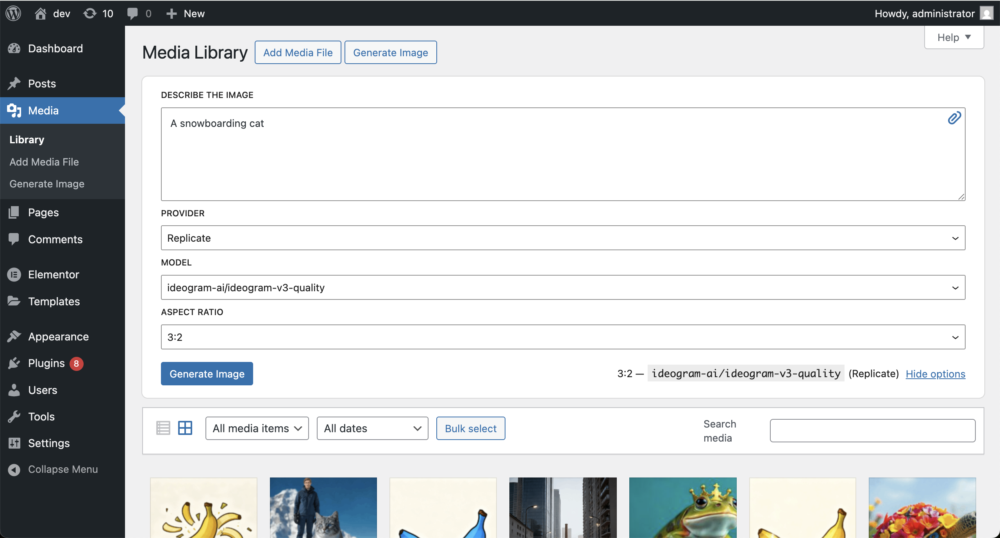
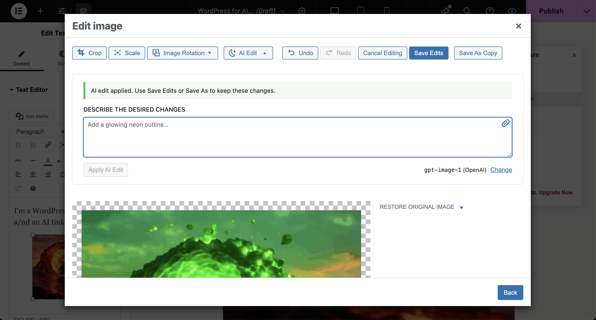
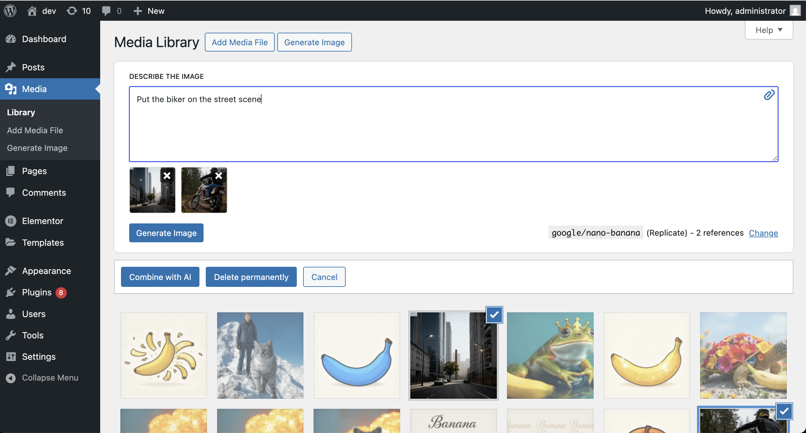
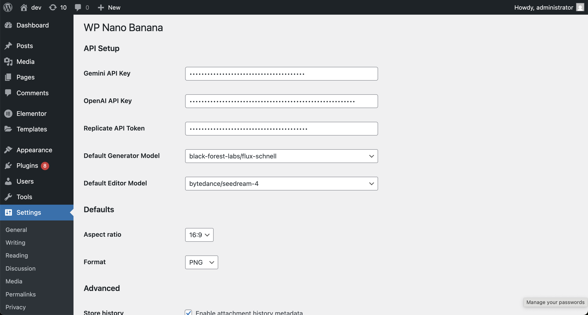

---

# WP Nano Banana

WP Nano Banana is a free WordPress plugin that lets you generate and edit images with AI, right inside your WordPress admin. Connects directly to your AI image generation API of choice. No ads, no locked features, no upsells, no flashy UI — just clean, native-like integration that feels like part of WordPress core.

- Combine existing images from your Media Library with new uploads
- Generate completely new images from text prompts
- Edit, enhance, and transform images using AI models like **Google Nano Banana**, **gpt-image-1**, **Seedream 4.0** and more
- Native-like integration in Gutenberg, Classic Editor, and most page builders

## Plugin Highlights

- **Native Integration**: Looks and feels like WordPress core — no flashy UI, no distractions
- **Free & Open Source**: 100% free, GPL-licensed, no upsells
- **Bring Your Own Key**: Connect your own Google, OpenAI or Replicate API key (no middleman fees)
- **Multiple AI Models**: Supports OpenAI’s `gpt-image-1`, Google's Nano Banana (`gemini-2.5-flash-image`), and more
- **Secure & Performant**: Clean codebase, minimal overhead, optimized for WordPress best practices
- **Universal Compatibility**: Works with Gutenberg, Classic Editor, Elementor, WooCommerce, ACF, and more

## Features

### AI Image Generation
- Create new images from simple text prompts
- Attach optional reference images from your computer or the Media Library to guide generation
- Use AI to generate featured images, blog graphics, product photos, and more
- Multiple model support: ChatGPT Image model, Seedream 4.0, Gemini 2.5 Flash Image

### AI Image Editing
- Select images from your Media Library or upload new ones
- Combine images to generate unique composites (e.g. product in different settings)
- Apply targeted edits (replace background, adjust style, regenerate parts)

### Media Library Integration
- Access AI generation and editing directly inside the Media Library and Media pop-up
- Edit images directly from the attachment details view
- Generate images while creating or editing posts and pages
- Compatible with image fields across WordPress, themes, and plugins
- Generated images are automatically saved to your WordPress Media Library

### Edit History & Undo
- Non-destructive editing with a full history of changes
- Preview edits before saving
- Undo/redo individual changes or revert to the original image
- Save edits as a new image or overwrite the original

### Developer-Friendly
- Built with hooks and filters for extensibility
- BYOK (Bring Your Own Key) approach — use your own API credentials
- Transparent, polished codebase — easy to audit and extend

## Installation

1. Download or clone this repository into your `/wp-content/plugins/` directory.
   ```bash
   git clone https://github.com/WP-Autoplugin/wp-banana.git
   ```

2. Activate **WP Nano Banana** from the **Plugins** menu in WordPress.
3. Go to **Settings → WP Nano Banana** and add your API key (OpenAI, Replicate, etc.).
4. Start generating and editing images right inside your WordPress dashboard.

## Usage Examples

### Generate a New Image

1. Open the Media Library or the Media pop-up in the Post Editor.
2. Click **Generate Image**.
3. Enter your text prompt (e.g. *"banana-shaped rocket flying through space in retro 90s neon style"*).
4. Click **Generate Image** to create the image in a few seconds.

### Combine Images

1. Select one or more images from the Media Library.
2. Click **Combine with AI**.
3. Provide a text prompt to guide the transformation.
4. A new AI-generated composite image is created and saved.

### Edit Existing Image

1. Open any image in the Media Library.
2. Click **Edit Image**, then **Edit with AI**.
3. Describe changes (e.g. *"remove background"*, *"make it look like watercolor"*, *"add subtle circuit board texture"*).
4. The edited image will appear in the preview area. You can undo changes if needed.
5. Click **Save Changes** to apply the edits or **Save Copy** to keep both versions.

## Screenshots

<details>
<summary>AI image generation from the Media Library</summary>


</details>

<details>
<summary>Image editing inside Elementor</summary>


</details>

<details>
<summary>Select and combine images</summary>


</details>

<details>
<summary>Settings page for API configuration</summary>


</details>

## Requirements

* WordPress 6.0+
* PHP 7.4+
* API key for supported AI providers (OpenAI, Replicate API, Google AI Studio)

## Supported AI Models

WP Nano Banana supports a wide range of state-of-the-art AI image models for both generation and editing. Below are some of the available models you can use:

- **Google Gemini 2.5 Flash Image**, a.k.a. **Google Nano Banana** (`gemini-2.5-flash-image` / `google/nano-banana`)
- **OpenAI GPT-Image-1** (`gpt-image-1`) - the same model used by ChatGPT for image generation and editing
- **Google Imagen 4** (`google/imagen-4`, `google/imagen-4-ultra`, `google/imagen-4-fast`)
- **FLUX Kontext** (`black-forest-labs/flux-kontext-max`, `black-forest-labs/flux-kontext-dev`)
- **FLUX 1.1 Pro** (`black-forest-labs/flux-1.1-pro`)
- **FLUX Schnell** (`black-forest-labs/flux-schnell`)
- **FLUX Dev** (`black-forest-labs/flux-dev`)
- **Recraft v3** (`recraft-ai/recraft-v3`)
- **Ideogram v3** (`ideogram-ai/ideogram-v3-turbo`, `ideogram-ai/ideogram-v3-quality`, `ideogram-ai/ideogram-v3-balanced`)
- **Bytedance Seedream 4** (`bytedance/seedream-4`)
- **Bytedance Seededit 3.0** (`bytedance/seededit-3.0`)
- **Qwen Image** (`qwen/qwen-image`, `qwen/qwen-image-edit`)
- **Google Imagen 4** (`google/imagen-4`, `google/imagen-4-ultra`, `google/imagen-4-fast`)

You can select from these models when generating or editing images, depending on your connected provider and the task at hand.

## Contributing

Contributions are welcome! Please open an [issue](https://github.com/WP-Autoplugin/wp-banana/issues) or submit a pull request.

## License

GPL-2.0 or later — [https://www.gnu.org/licenses/gpl-2.0.html](https://www.gnu.org/licenses/gpl-2.0.html)